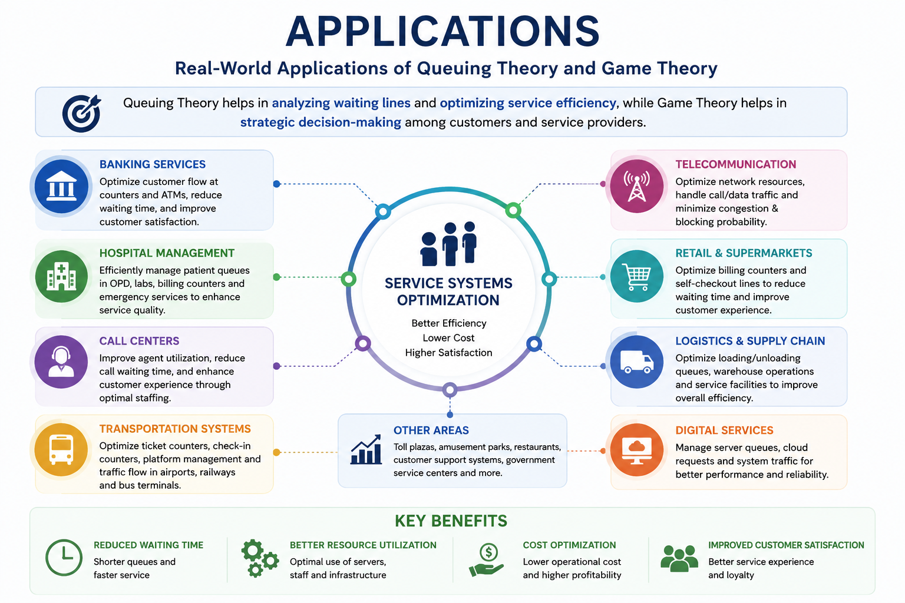

# Optimization-of-Service-Systems-Using-Queuing-Theory-and-Game-Theory
Research project on optimizing service systems using Queuing Theory and Game Theory with applications in banking, operations research, and data analytics.

> **Research Project | Operations Research | Mathematical Modeling | Data Analytics**

## 📖 Overview

This research project explores how **Queuing Theory** and **Game Theory** can be integrated to optimize service systems by reducing waiting times, improving resource utilization, and supporting strategic decision-making.

The study focuses on mathematical models that help improve the performance of service-based organizations such as banks, hospitals, call centers, transportation systems, and telecommunication networks.

---

## 🎯 Objectives

- Analyze classical queuing models
- Study waiting line performance measures
- Apply Game Theory for strategic decision-making
- Optimize service efficiency
- Explore applications in banking and service industries
- Understand the role of mathematical optimization in Data Analytics

---

## 📚 Topics Covered

- Introduction to Queuing Theory
- Kendall's Notation
- M/M/1 Queue Model
- M/M/c Queue Model
- M/G/1 Queue Model
- Little's Law
- Waiting Time Analysis
- Queue Length Analysis
- Server Utilization
- Cost Optimization
- Nash Equilibrium
- Strategic Customer Behavior
- Integrated Queuing–Game Theory Model
- Banking Service System Case Study
- Future Scope

---

## 🏦 Real-World Applications

- Banking Operations
- ATM Queue Management
- Hospital Management
- Call Centers
- Transportation Systems
- Airports
- Railway Reservation Systems
- Telecommunication Networks
- Logistics & Supply Chain
- Customer Service Optimization

---

## 📊 Relevance to Data Analytics

This research demonstrates how mathematical models support data-driven decision-making through:

- Operations Analytics
- Business Analytics
- Performance Measurement
- Resource Allocation
- Predictive Analysis
- Optimization Techniques
- Decision Science

---

## 🛠 Skills Demonstrated

- Mathematical Modeling
- Operations Research
- Queuing Theory
- Game Theory
- Optimization Techniques
- Analytical Thinking
- Research Methodology
- Problem Solving
- Data Analysis
- Technical Documentation

---

## 📄 Repository Contents

```
📁 Repository
│
├── Research_Report.pdf
├── LinkedIn_Carousel.pdf
└── README.md
└── assets
    ├── cover.png
    ├── queue-model.png
    └── banking-case-study.png
        applications.png


```
# Optimization of Service Systems Using Queuing Theory and Game Theory


## 📖 Overview

This research project explores how Queuing Theory and Game Theory can optimize service systems.

---

## 🧮 Queuing System


---

## 🌍 Real-World Applications



--- **Bank case study .png**
[Bank case study](assets/Bank-case%20study.PNG)

## 📄 Research Report

The complete research report is available in this repository.
---

## 🤖 AI Assistance

Artificial Intelligence tools were used to support literature exploration, content organization, drafting, and presentation design. All concepts, mathematical models, and the final review were studied, verified, and compiled as part of this research project.

---

## 🎓 Academic Information

**Project Title:** Optimization of Service Systems Using Queuing Theory and Game Theory

**Course:** Master of Science (Mathematics)

**Institution:** Janta Vedic College, Baraut, Baghpat

**University:** Chaudhary Charan Singh University, Meerut

**Session:** 2025–2027

---

## 📬 Connect With Me

**LinkedIn:** www.linkedin.com/in/niketa-dangi-bbb3533bb

**GitHub:** https://github.com/Niketa-dangi

---

### ⭐ If you found this project interesting, feel free to explore the report, share your feedback, or connect with me for discussions on Operations Research, Mathematics, and Data Analytics.
